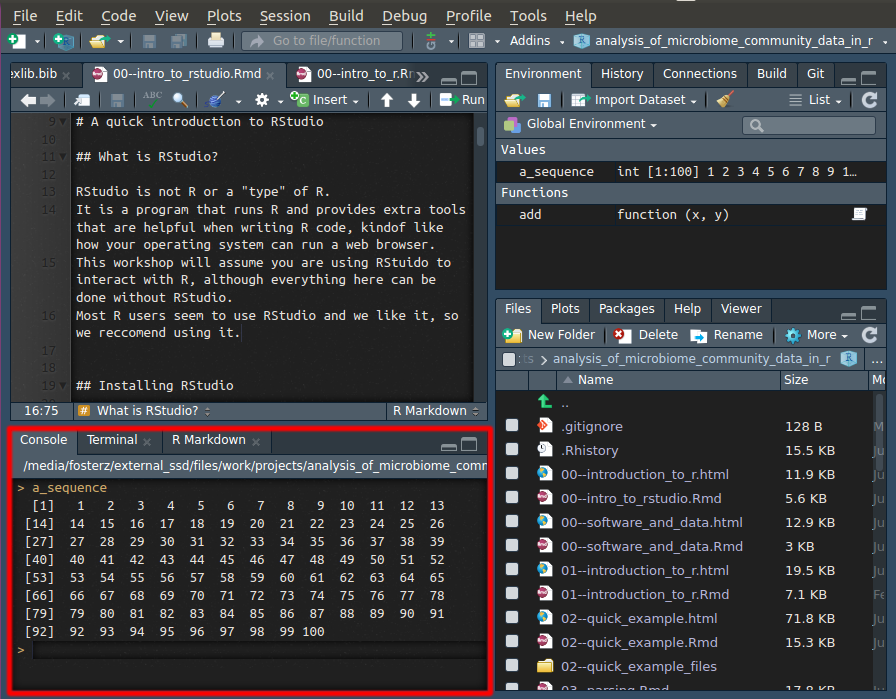
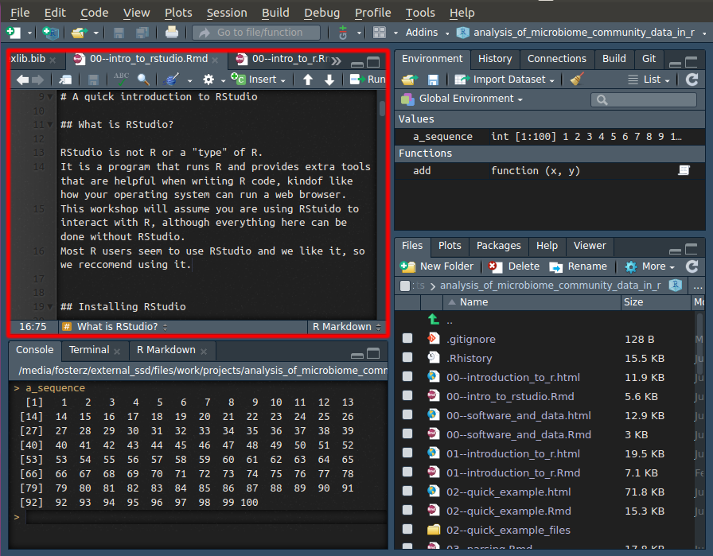
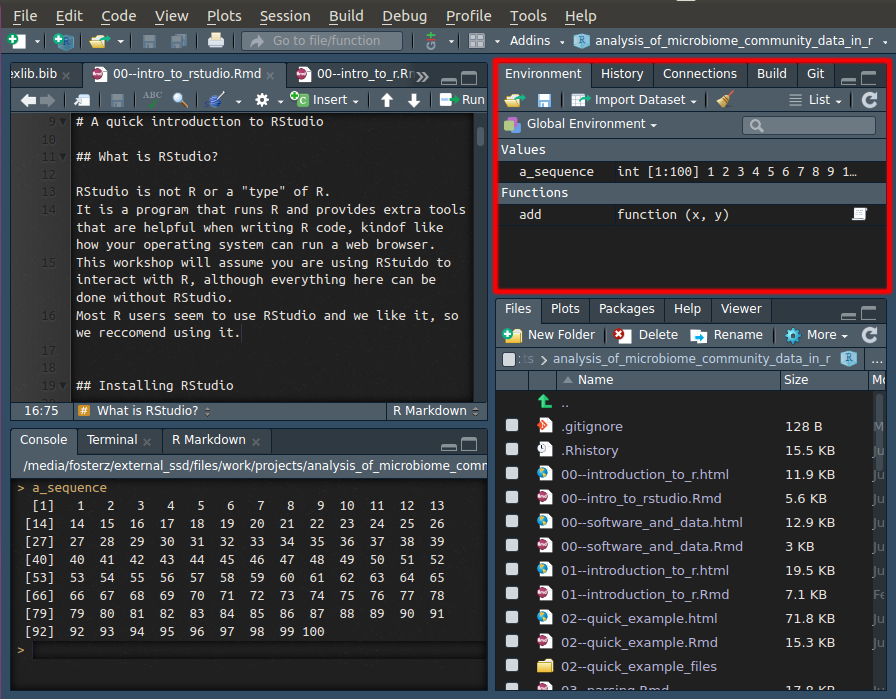

```{r setup, include=FALSE}
source("style.R")
```

# A quick introduction to RStudio

RStudio is not R or a "type" of R.
It is a program that runs R and provides extra tools that are helpful when writing R code, kind of like how your operating system can run a web browser.
This workshop will assume you are using RStudio to interact with R, although everything here can be done without RStudio.
Most R users seem to use RStudio and we like it, so we recommend using it.


## Installing RStudio

The main version of RStudio that most people use is free and open source and can be downloaded here:

https://www.rstudio.com/products/rstudio/download/#download

## The parts of RStudio

When you open RStudio, you will notice a lot of different windows, each with some tabs.
This can be overwhelming at first, but you only need to use a few to be productive and the ones you need are similar to other computer programs you probably already use.

### The R console tab



The `r gloss$add('R console')` is where you give R commands and is the lower left window in RStudio.
It is the same way you would interact with R on the command line or terminal.
In other words, the "Console" tab in the lower left window is the only part of RStudio that is actually R itself; everything else is optional tools. 

### The text editor



The upper left window is a `r gloss$add('plain text')` editor, like Notepad or TextEdit.
"Plain text" means no fonts, formatting etc, unlike program like Microsoft Word.
You can have multiple files open at once and they appear in tabs.
Depending on the type of the file being edited (i.e. its file extension), there will be different tools and behavior, but its all plain text.

### The file browser tab


The default tab in the lower right window is a basic file browser.
You can open, delete, and rename files there.
Its not as well-developed as your operating system's file browser and is mostly there so you don't have to switch applications to manage files.
You can ignore the rest of the tabs there for now (Plots, Packages, Help, and Viewer), since they are usually automatically opened when they are relevant.

### The "Environment" tab



The "Environment" tab in the top right window lists the `r gloss$add('variable', shown = 'variables')` and `r gloss$add('function', shown = 'functions')` present in the current R session.
It does not include the function/data in loaded packages however (unless you select a package from the drop down menu that says "Global Environment").
When you ask "what have I created so far", the answer is in the environment tab. 

## Console tricks

### Code completion

RStudio has a very useful feature called code completion using the <kbd>Tab</kbd> key which can complete the full name of an object. 
For example type `hel` and hit <kbd>Tab</kbd> and you will see several functions pop up and you can select `help()`.

This also works inside a function to find function arguments.
Type `help(` and hit <kbd>Tab</kbd> to select arguments for the help function.

### Command history

RStudio records your command history and you can scroll up or down the history of executed commands using the *Up* or *Down* keys.
Make sure your cursor is in the console and try to re-execute previous commands.

### Quickly running code in a file

Its best to write even experimental code in a file in the text editor, rather than writing it directly to the console, but it can get tedious to always be copying and pasting to try it out.
Instead, you can move the cursor to the line you want to run in the text editor and <kbd>Ctrl</kbd> + <kbd>Enter</kbd> to copy, paste, and execute the line in the console all at once.
This is a good habit to develop.

## R projects

`r gloss$add('R project', shown = 'R projects')` are an RStudio concept and are integral to many people's workflow and organization.
An R project is just a folder that has a file in it ending in ".Rproj".
This file is created by RStudio when you create a new project.
Although R projects are not needed, we highly recommend using them for the following reasons:

* They help with organization, since they encourage you to put all the code and data for a project in a single directory.
* They help standardize your current working directory. Each time a project is opened, your current working directory is automatically switched to the project directory.
* They store where you left off when you last closed RStudio. Depending on how you set things up, its as if you never closed RStudio at all. All the variables and files will be where you last left them. Even unsaved files. NOTE: It is recommended that you do not rely on restoring variables between sessions, although RStudio will offer. 

Whenever you start something in R that you want to save, we recommend using an R project.
You can make a new project by clicking on the upper right drop-down menu or "File > New Project".


### Everything else

Don't worry about it!
Its all useful, but not needed when you start, and some of it you will likely never use.


