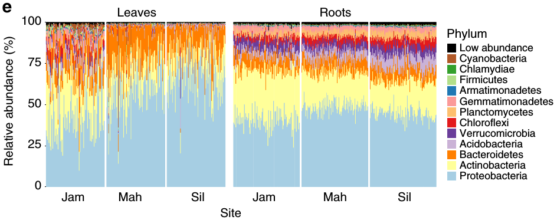

```{r setup, include=FALSE}
source("style.R")
```

# Plotting taxonomic data

Throughout this workshop we will be making many familiar types of graphs using `ggplot2` and we will explain how they are made as we go.
In this section however, we will focus on using the `metacoder` package to plot information on a taxonomic tree using color and size to display data associated with taxa.

Taxonomic data can be difficult to graph since it is hierarchical.
For example, if you have abundance information for each taxon and want to graph it, what kind of plot do you use? 
Stacked bar charts and pie graphs are common choices, but these ignore the hierarchical nature of the data; typically only a single `r gloss$add('Taxonomic ranks', shown = 'rank')` is graphed.
For example the graph below is from the publication [see @wagner2016host] that described the data set we are working with:

```{r echo=FALSE, out.width='100%'}

```

Although this is a well-constructed graph, its usefulness is limited by the nature of stacked barcharts.
The reliance on color to differentiate taxa means that the maximum number of taxa that can be effectively displayed is limited by the number of colors that can be distinguished.
This is typically around 10, maybe 13 with careful selection (as in the graph above), but definitely not more than 15.
For those who are color blind (~ 4% of people), even fewer colors can be used. 
This limitation is likely the reason @wagner2016host chose to show phylum-level abundances and grouped some phyla into a "Low abundance" category, even though there might be interesting pattern in finer ranks (e.g. genus or species).
This is typical of most publications, which either show only the most coarse ranks (e.g. phylum) or only the ~10 most abundant taxa when using stacked barcharts.
As an alternative/complement to stacked barcharts, we have developed what we call "heat trees" to display statistics associated with taxa (e.g. abundance) in a tree format.

## Load example data

If you are starting the workshop at this section, or had problems running code in a previous section, use the following code to load data used in this section.
If `obj` and `sample_data` are already in your environment from a previous section, you can ignore the following command.

```{r}
load("filtered_data.Rdata")
```


## Heat trees

The `metacoder` package implements "heat trees" to graph taxonomic data (@foster2017metacoder).
This visualization technique uses the color and size of parts of a taxonomic tree to display numeric data associated with taxa.
Below is an example of a heat tree showing the number of `r gloss$add('Operational Taxonomic Units (OTUs)')` in all taxa down to the class level:

```{r echo = FALSE, message=FALSE}
library(metacoder)
obj %>% 
  filter_taxa(grepl(pattern = "^[a-zA-Z]+$", taxon_names)) %>% # remove "odd" taxa
  filter_taxa(taxon_ranks == "o", supertaxa = TRUE) %>% # subset to the order rank
  heat_tree(node_label = gsub(pattern = "\\[|\\]", replacement = "", taxon_names),
            node_size = n_obs,
            node_color = n_obs,
            node_color_axis_label = "OTU count",
            layout = "davidson-harel", initial_layout = "reingold-tilford")
```

This is a type of taxonomic tree where each node (the circles) is a taxon and the edges (lines) show hierarchical relationships between taxa.
For example, the large *Proteobacteria* phylum node contains the *Alphaproteobacteria* and *Gammaproteobacteria* classes.
This is a relatively small heat tree meant as a demonstration; much larger and more intricate ones are also possible.
We are going to go through the process of creating figures like this one in this section.
Although this might seem like complicated code to make this figure, code like this is typically the result of iterative small improvements started from a simple base.
We will imitate this process here for demonstration. 

### Getting started

The `heat_tree` function takes a `taxmap` object as its first argument. 
Lets start with the simplest possible code:

```{r}
heat_tree(obj)
```

This is not too useful, but at least its easy!
Lets plot some data to make things more interesting.
A good place to start is to plot the number of OTUs (or other types of taxon observations) with both the color and size of nodes.
The taxon names are added here as well.

```{r}
heat_tree(obj,
          node_label = taxon_names,
          node_size = n_obs,
          node_color = n_obs)
```

As with many other functions from `taxa` and `metacoder`, any table column or `r gloss$add('function')` associated with the `taxmap` object being plotted can be refereed to as if it was an independent variable in the function call.
For example, the last plot could also have been made this way:

```{r eval = FALSE}
heat_tree(obj,
          node_label = taxon_names(obj),
          node_size = n_obs(obj),
          node_color = n_obs(obj))
```

The default layout is pretty cluttered with this amount of taxa (`r length(obj$taxa)`), so the labels are not readable without saving the graph as a PDF and zooming in.
With enough tweaking, we probably could make a tree with all `r length(obj$taxa)` taxa that looks good without a PDF viewer, but for this demonstration, we will try to make a plot that could be used in a publication with minimal zooming.
So, lets remove all taxa below the order rank to cut down the number of taxa displayed. 
We will also save the output as a PDF so we can take a closer look at the output.
Since the manipulation functions provided the `taxa` package also operate on `taxmap` objects, we can use functions like `filter_taxa` to modify what is passed to `heat_tree`:

```{r}
obj %>%
  filter_taxa(taxon_ranks == "o", supertaxa = TRUE) %>% # subset to the class rank
  heat_tree(node_label = taxon_names,
            node_size = n_obs,
            node_color = n_obs,
            output_file = "plot_example.pdf")
```

If we zoom in on the output, we can see a lot of taxa with odd names like "Ellin329" and "BD7−3".
During analysis such taxa might be important to see, but for publication purposes, most can probably be removed from the plot to make it easier to understand.
We can filter those taxa out before plotting using a regular expression that only matches letters:

```{r}
obj %>%
  filter_taxa(grepl(pattern = "^[a-zA-Z]+$", taxon_names)) %>% # remove "odd" taxa
  filter_taxa(taxon_ranks == "o", supertaxa = TRUE) %>% # subset to the class rank
  heat_tree(node_label = taxon_names,
            node_size = n_obs,
            node_color = n_obs,
            output_file = "plot_example.pdf")
```

Now we are getting to something more understandable.
Lets play with the layout to see if we can find one that spaces things out better.
There are lots of layouts available, but only few produce reasonable results most of the time.
Some of the better ones for this use include:

* reingold-tilford (the default)
* davidson-harel
* fruchterman-reingold

You only need to use the first few letters of each name.
Lets look at these other two formats.
First, fruchterman-reingold:

```{r}
obj %>%
  filter_taxa(grepl(pattern = "^[a-zA-Z]+$", taxon_names)) %>% # remove "odd" taxa
  filter_taxa(taxon_ranks == "o", supertaxa = TRUE) %>% # subset to the class rank
  heat_tree(node_label = taxon_names,
            node_size = n_obs,
            node_color = n_obs,
            layout = "fr",
            output_file = "plot_example.pdf")
```

These types of layouts have a random component to how they are made, so running the same code twice will produce different layouts.
Try running the above code again to see this.
We can force it to be the same each time by setting the `r gloss$add('Random number generator seeds', shown = 'seed')` for the random number generator used by R, as is done in the next example.
The last layout is not too bad, but does not make good use of space.
Lets try davidson-harel:

```{r}
set.seed(1) # Each number will produce a slightly different result for some layouts
obj %>%
  filter_taxa(grepl(pattern = "^[a-zA-Z]+$", taxon_names)) %>% # remove "odd" taxa
  filter_taxa(taxon_ranks == "o", supertaxa = TRUE) %>% # subset to the class rank
  heat_tree(node_label = taxon_names,
            node_size = n_obs,
            node_color = n_obs,
            layout = "da",
            output_file = "plot_example.pdf")
```

That's a bit better, but there is one more thing we can try.
The `heat_tree` functions allows you to set an "initial" layout that is used as the starting point for these other layouts.
We have found the combination of "reingold-tilford" and "davidson-harel" to be space-efficient for large plots.

```{r}
set.seed(2) # Each number will produce a slightly different result for some layouts
obj %>%
  filter_taxa(grepl(pattern = "^[a-zA-Z]+$", taxon_names)) %>% # remove "odd" taxa
  filter_taxa(taxon_ranks == "o", supertaxa = TRUE) %>% # subset to the class rank
  heat_tree(node_label = taxon_names,
            node_size = n_obs,
            node_color = n_obs,
            initial_layout = "re", layout = "da",
            output_file = "plot_example.pdf")
```

Up until now, we have set both the color and size to display the number of OTUs, but they can be set to different things.
Lets set the color to the number of `r gloss$add('supertaxa')` that each taxon is included in.

```{r}
set.seed(2) # Each number will produce a slightly different result for some layouts
obj %>%
  filter_taxa(grepl(pattern = "^[a-zA-Z]+$", taxon_names)) %>% # remove "odd" taxa
  filter_taxa(taxon_ranks == "o", supertaxa = TRUE) %>% # subset to the class rank
  heat_tree(node_label = taxon_names,
            node_size = n_obs,
            node_color = n_supertaxa,
            initial_layout = "re", layout = "da",
            output_file = "plot_example.pdf")
```

Note how both sides of the legend on the bottom right have numbers now.
The left side is the color legend and the right is the size legend. 

### Setting edge attributes

Just like the node size/color, the edge size/color can be used to display statistics.
Edges can also have labels.
This means you can plot 4 statistics in one graph, although more than 3 is typically overwhelming.
However, we need some more things to graph, so we will calculate the number of reads in each taxon, grouping samples by leaf/root samples.

```{r}
obj$data$tax_abund <- calc_taxon_abund(obj, "otu_counts",
                                       cols = sample_data$SampleID,
                                       groups = sample_data$Type)
print(obj$data$tax_abund)
```

Since the "leaf" and "root" columns have one value per taxon, they can be used for plotting.
We can set the root read counts to the node color and the leaf read counts to the edge color.

```{r}
set.seed(2) # Each number will produce a slightly different result for some layouts
obj %>%
  filter_taxa(grepl(pattern = "^[a-zA-Z]+$", taxon_names)) %>% # remove "odd" taxa
  filter_taxa(taxon_ranks == "o", supertaxa = TRUE) %>% # subset to the class rank
  heat_tree(node_label = taxon_names,
            node_size = n_obs,
            node_color = root, 
            edge_color = leaf,
            initial_layout = "re", layout = "da",
            output_file = "plot_example.pdf")
```

Note how there are two legends now, one for edge color/size and one for node color/size.
We can also add labels to the edges.
For example, we can print the number of OTUs assigned to each taxon like so:

```{r}
set.seed(2) # Each number will produce a slightly different result for some layouts
obj %>%
  filter_taxa(grepl(pattern = "^[a-zA-Z]+$", taxon_names)) %>% # remove "odd" taxa
  filter_taxa(taxon_ranks == "o", supertaxa = TRUE) %>% # subset to the class rank
  heat_tree(node_label = taxon_names,
            node_size = n_obs,
            node_color = root, 
            edge_label = n_obs,
            initial_layout = "re", layout = "da",
            output_file = "plot_example.pdf")
```

### Setting titles and legend lables

You can add a title to the graph and change the legend labels to make the graph easier to understand, using the `title` option and options ending in `_axis_label`.

```{r}
set.seed(2) # Each number will produce a slightly different result for some layouts
obj %>%
  filter_taxa(grepl(pattern = "^[a-zA-Z]+$", taxon_names)) %>% # remove "odd" taxa
  filter_taxa(taxon_ranks == "o", supertaxa = TRUE) %>% # subset to the class rank
  heat_tree(node_label = taxon_names,
            node_size = n_obs,
            node_color = root,
            initial_layout = "re", layout = "da",
            title = "Root sample read depth",
            node_color_axis_label = "Sum of root reads",
            node_size_axis_label = "Number of OTUs",
            output_file = "plot_example.pdf")
```

There are similar options for the edge color and edge size.

### Changing the colors used

You can change the colors used in the plot using the `node_color_range` and `edge_color_range` options.
These accept two or more colors, either as common color names (e.g. `c("red", "green")`) or `r gloss$add('hexadecimal color codes')` (e.g. `#000000` is black).


```{r}
set.seed(2) # Each number will produce a slightly different result for some layouts
obj %>%
  filter_taxa(grepl(pattern = "^[a-zA-Z]+$", taxon_names)) %>% # remove "odd" taxa
  filter_taxa(taxon_ranks == "o", supertaxa = TRUE) %>% # subset to the class rank
  heat_tree(node_label = taxon_names,
            node_size = n_obs,
            node_color = root,
            node_color_range = c("red", "yellow", "green", "blue"),
            initial_layout = "re", layout = "da",
            title = "Root sample read depth",
            node_color_axis_label = "Sum of root reads",
            node_size_axis_label = "Number of OTUs",
            output_file = "plot_example.pdf")
```

### Changing the size of elements

By default, the size of nodes, edges, and labels are automatically optimized to avoid overlaps while maximizing apparent size differences.
You can also force these to be a specific size range.
For example, `node_size_range = c(0.01, 0.02)` means that the largest node will be 2% of the graph's width and the smallest will be 1% of the graph's width.
There are analogous options for edges and labels.
Lets use this to make the smallest nodes smaller and make all edges the same size.

```{r}
set.seed(2) # Each number will produce a slightly different result for some layouts
obj %>%
  filter_taxa(grepl(pattern = "^[a-zA-Z]+$", taxon_names)) %>% # remove "odd" taxa
  filter_taxa(taxon_ranks == "o", supertaxa = TRUE) %>% # subset to the class rank
  heat_tree(node_label = taxon_names,
            node_size = n_obs,
            node_size_range = c(0.01, 0.05),
            edge_size_range = c(0.005, 0.005),
            node_color = root,
            initial_layout = "re", layout = "da",
            title = "Root sample read depth",
            node_color_axis_label = "Sum of root reads",
            node_size_axis_label = "Number of OTUs",
            output_file = "plot_example.pdf")
```

### Trees with multiple roots

In all the trees we have made so far have a single "root".
A "root" is a taxon without a supertaxon. 
Common examples of roots in taxonomy databases include coarse taxa like "fungi", "bacteria", or "cellular organisms".
When a taxonomy has multiple roots, multiple trees are graphed in the same plot.
We can force multiple roots to demonstrate this by selecting some taxa without preserving supertaxa:

```{r}
set.seed(1) # Each number will produce a slightly different result for some layouts
obj %>%
  filter_taxa(grepl(pattern = "^[a-zA-Z]+$", taxon_names)) %>% # remove "odd" taxa
  filter_taxa(taxon_names %in% c("Proteobacteria", "Actinobacteria", "Firmicutes"),
              subtaxa = TRUE) %>% 
  heat_tree(node_label = taxon_names,
            node_size = n_obs,
            node_color = root,
            tree_label = taxon_names,
            initial_layout = "re", layout = "da",
            title = "Root sample read depth",
            node_color_axis_label = "Sum of root reads",
            node_size_axis_label = "Number of OTUs",
            output_file = "plot_example.pdf")
```

Note the use of the `tree_label` option used to add the tree labels based on the name of their root taxa.
This can be used to make very large taxonomies easier to understand or emphasize the difference between taxa.

## Exercises

**1a)** Make a plot of *Firmicutes* and `r gloss$add('subtaxa')` with the size of nodes proportional to the number of OTUs and label the nodes with taxon names.

```{r hide_button = TRUE}
obj %>%
  filter_taxa(taxon_names == "Firmicutes", subtaxa = TRUE) %>%
  heat_tree(node_size = n_obs,
            node_label = taxon_names)
```


**1b)** Modify the plot you made in part **a** so that the taxon names and OTU counts are combined in the label like "my_taxon (123)". Hint: try `paste0` to combine multiple pieces of text.

```{r hide_button = TRUE}
obj %>%
  filter_taxa(taxon_names == "Firmicutes", subtaxa = TRUE) %>%
  heat_tree(node_size = n_obs,
            node_label = paste0(taxon_names, " (", n_obs, ")"))
```


**2a)** The function `n_subtaxa` returns the number of taxa each taxon has within it:

```{r}
head(n_subtaxa(obj))
```

Like, the `taxon_names` and `n_obs` functions, this returns one value per taxon, so is useful for plotting heat trees.
Try to make a tree of only *Proteobacteria* and its subtaxa where the size of nodes is proportional to the number of subtaxa.
Label the nodes by taxon names. 

```{r hide_button = TRUE}
obj %>%
  filter_taxa(taxon_names == "Proteobacteria", subtaxa = TRUE) %>%
  heat_tree(node_size = n_subtaxa,
            node_label = taxon_names)
```

**2b)** `heat_tree` has an option called `node_size_range` to force node sizes to be in a specified range instead of letting the function pick the maximum and minimum size. 
Remake the graph for **a**, but use `node_size_range` to make the node sizes vary between 0.5% and 5% of the graph width.

```{r hide_button = TRUE}
obj %>%
  filter_taxa(taxon_names == "Proteobacteria", subtaxa = TRUE) %>%
  heat_tree(node_size = n_subtaxa,
            node_label = taxon_names,
            node_size_range = c(0.005, 0.05))
```

**2c)** This made the node labels in the tips too small to read. We can also force the labels to be a specified range of sizes. Use the `node_label_size_range` option to make the tips readable without cluttering the graph too much.

```{r hide_button = TRUE}
obj %>%
  filter_taxa(taxon_names == "Proteobacteria", subtaxa = TRUE) %>%
  heat_tree(node_size = n_subtaxa,
            node_label = taxon_names,
            node_size_range = c(0.005, 0.05),
            node_label_size_range = c(0.008, 0.04))
```

**3a)** Using the "root" and "leaf" columns in the "tax_abund" table created earlier in this section for this example, plot the number of reads in leaf samples in "Proteobacteria" and subtaxa using the size and color of nodes.
Label the nodes with taxon names.

```{r hide_button = TRUE}
obj %>%
  filter_taxa(taxon_names == "Proteobacteria", subtaxa = TRUE) %>%
  heat_tree(node_size = leaf,
            node_color = leaf,
            node_label = taxon_names)
```

**3b)** Which taxon at the tip of the tree had the most reads in leaf samples?

```{r hide_button = "Show Answer", results = 'asis', echo = FALSE}
cat(
  "mitochondria"
)
```

**3c)** Try to adjust the plot you made in part **a** to remove any taxa with less than 100 reads. Hint: this can be done with `filter_taxa`.

```{r hide_button = TRUE}
obj %>%
  filter_taxa(taxon_names == "Proteobacteria", subtaxa = TRUE) %>%
  filter_taxa(leaf >= 100) %>%
  heat_tree(node_size = leaf,
            node_color = leaf,
            node_label = taxon_names)
```

**4a)** In addition to automatically coloring taxa to represent a number (e.g. OTU count), you can specify the color of each taxon using common color names (e.g. "red" or "blue") or hexadecimal color codes (e.g. "#000000" for black). You can either supply a single color to color everything the same or a vector of colors (e.g. c("red", "blue", ...)) with one value for each taxon.

Try to plot *Actinobacteria* and subtaxa with node size correlating with number of reads in root samples.
Color all edges a light blue. Enter `colors()` to see the list of named colors that can be used.

```{r hide_button = TRUE}
obj %>%
  filter_taxa(taxon_names == "Firmicutes", subtaxa = TRUE) %>%
  heat_tree(node_size = root,
            edge_color = "skyblue", # Other colors also correct
            node_label = taxon_names)
```

**4b)** Modify the command from part **a** so that all taxa on the tips (i.e. "leafs") are colored green and the rest are grey Hint: the `is_leaf` and `ifelse` functions might be useful. See the help page for these functions (e.g. Type `?is_leaf`).

```{r hide_button = TRUE}
obj %>%
  filter_taxa(taxon_names == "Firmicutes", subtaxa = TRUE) %>%
  heat_tree(node_size = leaf,
            edge_color = "skyblue", # Other colors also correct
            node_color = ifelse(is_leaf, "green", "grey"),
            node_label = taxon_names)
```

**4c)** Modify the command from part **b** to make the background of the plot beige. Look at the help pages for `heat_tree` (Type `?heat_tree`) to figure out what option to use.

```{r hide_button = TRUE}
obj %>%
  filter_taxa(taxon_names == "Firmicutes", subtaxa = TRUE) %>%
  heat_tree(node_size = leaf,
            edge_color = "skyblue", # Other colors also correct
            node_color = ifelse(is_leaf, "green", "grey"),
            node_label = taxon_names,
            background_color = "beige")
```


```{r, child="_sessioninfo.Rmd"}
```

## References
