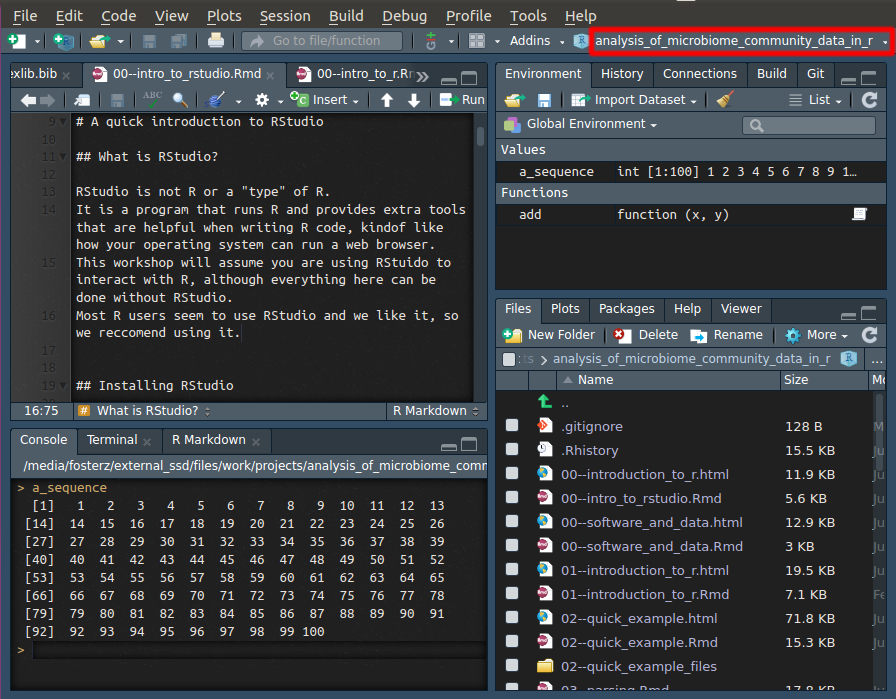

## R console

This is the text prompt you use to interact with R.
When R is started, the R console will look something like this: 

```
R version 3.4.4 (2018-03-15) -- "Someone to Lean On"
Copyright (C) 2018 The R Foundation for Statistical Computing
Platform: x86_64-pc-linux-gnu (64-bit)

R is free software and comes with ABSOLUTELY NO WARRANTY.
You are welcome to redistribute it under certain conditions.
Type 'license()' or 'licence()' for distribution details.

  Natural language support but running in an English locale

R is a collaborative project with many contributors.
Type 'contributors()' for more information and
'citation()' on how to cite R or R packages in publications.

Type 'demo()' for some demos, 'help()' for on-line help, or
'help.start()' for an HTML browser interface to help.
Type 'q()' to quit R.

> 
```


## Variable

In programming, a variable is a name associated with a value that can change or "vary".
This is similar to how the word is used in math.
For example, the equation for a line is `y = mx + b`.
In this equation, all of the letters are variables that can represent any number.

## Function

Any command or operation the does something in a programming language is a function.
Functions often have inputs that influence what the output is, but some don't have inputs.
Functions will usually return some type of output, but they might not, or they might have an effect besides what they return (this is rare in R, but common in other programming languages).
The concept of functions, like variables, comes from math.
For example, the equation for a line is `y = mx + b`.
In R, you could make a function to return `y` given the values of `m`, `x`, and `b`, like so: 

```{r}
line <- function(m, x, b) {
  return(m * x + b)
}
```

And find the value for y, for a given set of inputs like so: 

```{r}
line(m = 2.5, x = 3, b = -1)
```


## Class 

A class is a defined set of variables along with a set of functions designed to work with those variable.
The specifics of how classes are structured vary greatly between programming languages, but the concepts are similar.
For example, you might have a class called "Dog" that contained the dogs age (number), the dogs breed (text), and the name of the dogs owner (text).
With those variables, the "Dog" class might have functions that make the dog a year older or change the owner of the dog, etc.

## Object

An instance of a class.
In other words, a data with a defined type and functions designed to operate on it.
For example, if you had a class for "Dog", you might have an object of that class stored in a variable called "fido" and another called "scraps". 

## The Comprehensive R Archive Network (CRAN)

A volunteer-run organization that hosts R packages and enforces standards for how they should be structured.
When you install an R package using `install.packages`, you are installing from CRAN.
CRAN is one of the major reasons R packages are so easy to install.


## Plain text

Plain text is the term used to describe text editors like Notepad or TextEdit that do not have fonts, images, or other non-text things.
When you write R code, you are writing plain text.
All programming languages use plain text because it is simple and has very few dependencies.
Some programs for editing plain text might highlight relevant patterns in different colors, but these colors are specific to the program used to view the text, not the text itself.

## R project

"R projects" are an RStudio concept and are integral to many peoples workflow and organization.
An R project is just a folder that has a file in it ending in ".Rproj".
This file is created by RStudio when you create a new project.
Although R projects are not needed, we highly recommend using them for the following reasons:

* They help with organization, since they encourage you to put all the code and data for a project in a single directory.
* They help standardize your current working directory. Each time a project is opened, your current working directory is automatically switched to the project directory.
* They store where you left off when you last closed RStudio. Depending on how you set things up, its as if you never closed RStudio at all. All the variables and files will be where you last left them. Even unsaved files. NOTE: It is recommended that you do not rely on restoring variables between sessions, although RStudio will offer. 

Whenever you start something in R that you want to save, we recommend using an R project.
You can make a new project by clicking on the upper right drop-down menu or "File > New Project".



## R package

An R package is a set of user-defined functions organized so that people can easily share and use them.
Most of the functions used by most R users are from R packages rather than those supplied by base R.
R packages can be installed in a few ways, but the most common is to download them from The Comprehensive R Archive Network (CRAN) using the `install.packages` function.
For example `stringr` is an R package that supplies functions to work with text.

```{r eval = FALSE}
install.packages("stringr")
```

Once installed, a package must be "loaded" using the `library` function before any functions it supplies can be used:

```{r}
library("stringr")
```

Now we can use functions from the `stringr` package.


## Operational Taxonomic Units (OTUs)

OTUs are clusters of similar sequences often intended to correspond to some taxonomic rank, such as species.
They are used to estimate diversity and account for sequencing error.
Different barcodes (i.e. genes/loci) evolve at different rates, so the how similar sequences must be to be grouped together will vary depending on taxonomic group, the barcode used, and what taxonomic rank OTUs are intended to correspond to (if any).
There are two types of OTUs: *de novo* and "closed reference".
*De novo* OTUs are constructed based on pairwise distances between sequences and do not rely on reference databases.
Closed reference OTUs (aka phylotypes) are made by comparing sequences to references databases and clustering base on distance from the most similar reference sequence.
For the limitations of OTUs and alternative approaches, see:

Callahan, Benjamin J., Paul J. McMurdie, and Susan P. Holmes. "Exact sequence variants should replace operational taxonomic units in marker-gene data analysis." The ISME journal 11.12 (2017): 2639.

## Phylotypes

There seems to be some variation in how the term "phylotype" is used, but here we will use the following definition.
Phylotypes are groupings of sequences based on their similarity to a reference sequence.
These differ from *de novo* OTUs due to their reliance on a similar reference sequence.
They are the same as "closed reference" OTUs. 

## Exact sequence variants (ESVs)

Also called Amplicon Sequence Variants (ASVs).
ESVs are the inferred unique sequences present in the original sample, after correcting for sequencing and PCR errors.
See the following for reasons to use ESVs instead of OTUs:

Callahan, Benjamin J., Paul J. McMurdie, and Susan P. Holmes. "Exact sequence variants should replace operational taxonomic units in marker-gene data analysis." The ISME journal 11.12 (2017): 2639.


## List

A common R data type used to hold an ordered set of other R data of any type.
Unlike a vector, a single list can have data of multiple types.
For example you can make a list of vectors of different types:

```{r}
list(1:3, "bob", c(TRUE, FALSE))
```


## Vector

An ordered set of data of the same type.
This is one of the most common types of data used in R.
Any number or piece of text in R is a vector.
For example, typing `5` produces a `numeric` vector of length 1:

```{r}
5
```

And typing `1:10` produces a `numeric` vector of length 10:

```{r}
1:10
```

Vectors can also be other types like `character`:

```{r}
c("hello", "world")
```


## Taxonomic ranks

Ranks are the level a taxon appears in a nested hierarchy of taxa.
Common ranks include species, genus, family, order, class, phylum, and domain, although there might be others.

## Rarefaction

Subsets counts of types (e.g. OTUs or species) in a sample to some total number of counts.
For example, a sample with 4 counts of A and 2 counts of B, rarefied to a total of 3, would (on average) become 2 counts of A and 1 count of B.
This is used to transform read counts to simulate equal sampling depth, since different samples usually have different numbers of reads, due to unavoidable inconsistencies in high-throughput sequencing.
This is important when evaluating the relative diversity among a set of samples, since higher numbers of reads mean rare species are more likely to be observed.

## Chimeric sequences

Sequences composed of two or more pieces of unrelated DNA caused by "errors" during PCR when an incomplete amplicon acts as a primer for a different template in a subsequent cycle.

## Compositional data

When counts have a fixed total regardless of the actual abundance of things counted.
All microbiome data is compositional because we sequence some number of reads regardless of how many PCR amplicons there were or template DNA molecules; i.e. we don't get more reads from samples with more DNA.
This means the number of reads for a given organism does not relate to its abundance, but it abundance relative to other organisms in the community (assuming no other biases).
Its important to keep this in mind because many common statistical techniques assume independence of observations and read counts are not independent.
For example, if you have 10 reads of a organism in one sample and 5 reads in another, it could be that the organisms is equally abundant in both, but the second community just has a lot more other species as well. 

## Inverse Simpson index

An alternate way of encoding the Simpson index with numbers greater than 1.
Assuming a theoretically community where all species were equally abundant, this would be the number of species needed to have the same Simpson index value for the community being analyzed.

## Analysis of variance (ANOVA)

A statistical technique to determine of one of two or more sample means is different from the others.
If a the result is significant, it still does not tell you which of the means were different, just that at least one was different.
To see which of the means are different from the others, you can use the Tukey's Honest Significant Difference (HSD) test.

## Tukey's Honest Significant Difference (HSD)

A test the can be used after an ANOVA to tell which of a set of samples means are different from each other by performing pairwise comparisons.

## Base R

This is the term used for all of the R functions that are loaded by default when starting R, without installing or loading any packages explicitly.

## Multiple comparison corrections

The p-value in a statistical test measures the likelihood that an such a result or more extreme would occur by chance if the experiment was run repeatedly (making lots of assumptions about the variance of the test statistic).
If many tests are run on subsets of the data, then the chance that at least one has a "significant" p value by chance goes up and the p-value for each test is no longer accurate.
There are a set of techniques to correct these p-values called multiple comparison corrections.
Commons ones include the False discovery rate (FDR) and Bonferroni corrections.

## Wilcoxon Rank Sum test

A non-parametric test (i.e. does not rely on a normal distribution) that tests if a randomly selected value from one population is greater on average than a randomly selected value from another.
It can be thought of as the equivalent of a t-test, but only takes into account the *if* a value is greater than another value, rather than *how much* greater it is. 

## Amplicon

A piece of DNA produced by PCR.

## Pipelines

A term used for a series of programs (often automated) used to process data where each program takes the output of the one before as input.
The term is generally used when the individual programs used are useful on their own for a specific purpose, rather then for small all-purpose tools like R functions. 

## Tibble

An enhanced `data.frame` with better appearance when printed to the console and more consistent behavior.
Tibbles do not allow for row names, since their designer, Hadley Wickham, thinks all data should be treated the same and row names are a kind of "special" case.
Here is an example of a tibble compared to a `data.frame`:

```{r}
# data.frame
mtcars
```

```{r eval = FALSE}
# tibble
dplyr::as.tbl(mtcars)
```

```{r echo = FALSE}
options(crayon.enabled = FALSE)
dplyr::as.tbl(mtcars)
options(crayon.enabled = TRUE)
```


## Regular expressions

Also knows as a "regex".
It is a kind of computer language used to specify and search for patterns in plain text.
It is widely used in other languages like R, python, and Perl.
Most regular expressions are composed of a series of "what to match" followed by "how many times to match".
For example, `"John [a-z]+"` would match any instance of the word "John" followed by a space and one ore more lower case letters.
Regular expressions can be very complicated, but are also very useful. 

## Capture groups

A way of specifying subsets of a regular expressions that are of interest, often for the purpose of extracting the values that those portions match.
They are specified by parentheses and do not change what the regular expression matches.
For example, extracting the capture group in `"John ([a-z]+)"` would return the last name of people with the first name "John".

## Taxonomic classifications

The set of nested taxa an organism belongs to.
For example, the taxonomic classification of *Homo sapiens* is: 

Animalia > Chordata > Mammalia > Primates > Haplorhini > Simiiformes > Hominidae > Homininae > Hominini > Homo > H. sapiens


## Random number generator seeds

Random number generators are used by computers to simulate randomness, but are not actually random.
They work by taking a starting number and running that number through a function that returns another number, which is then run through the same function to produce another number and so on.
The first number is the "seed" and a given seed will always produce the same series of random numbers.
Random number generators appear random because the seed that is chosen when the generator is created is usually something like the milliseconds on your computer's internal clock.
You can however set the seed yourself if you always want the same "random" behavior using the `set.seed` function.
For example:

```{r}
rnorm(3) # produces 3 "random" numbers from a normal distribution
rnorm(3)
set.seed(1)
rnorm(3)
set.seed(1)
rnorm(3)
```


## Subtaxa

The taxa contained within another taxon.
For example, *Homo sapiens* is a subtaxon of the genus *Homo*.


## Supertaxa

The taxa a taxon is contained within.
For example, *Homo* is a supertaxon of the species *Homo sapiens*.


## Hexadecimal color codes

A way of encoding colors using 6 numbers or letters.
Colors on a computer are made by varying the intensity of red, green, and blue.
The intensity of each color is encoded from 0-255 (1 byte) and converted to a base 16 numbering system that uses the numbers 0-9 and the letters A-F, so it only takes 2 digits to encode 256 values.
Three pairs of two digits corresponding to the intensity of red, green, and blue make up a hexadecimal color code.
For example, `"#FF0000"` is the most intense red and corresponds to red = 255, green = 0, and blue = 0.
Black is `"#000000"` and white is `"#FFFFFF"`.

## Singleton

A sequence that only appears once in a sample or in all samples, depending on the exact definition being used.

## Doubletons

A sequence that only appears twice in a sample or in all samples, depending on the exact definition being used.

## Transpose

To "turn" a table or matrix 90 degrees, making the rows into columns and the columns into rows.

## Tab-delimited text file

Also known as tab-separated value (TSV) format and usually has the file extension `.tsv`.
A plain text file used to store tables.
Each row is one line and columns are separated by tabs (i.e. `\\t`).

## Comma-delimited text file

Also known as comma-separated value (CSV) format and usually has the file extension `.csv`.
A plain text file used to store tables.
Each row is one line and columns are separated by commas (i.e. `,`).

## Vignette

A short tutorial-like document included in R pacakges to help new users get familar with the package.
These can be found online or accessed in the installed package using the `browseVignettes` function.
For example, you can see `vegan`'s vignettes by typing the following into an R console:

```{r eval = FALSE}
browseVignettes(package = "vegan")
```

## RStudio

A program used write and organize projects with R code.
It can run R, but is not R itself, and relies on a seperate installation of R to work.

## Parsing

The word "parsing" is used in different ways, but in the context of data science, it means to transform data from one form to another.
For example, to read a text file into R and store it as a `data.frame` would be to parse that file since the data is changing forms.

## Non-standard evaluation (NSE)

This is a rather advanced programming technique that allows for code in a function call to be interpreted by R in a different way from how it would be interpreted outside that function call.
It is used by many R functions to make them easier to read and reduce typing.
For example, the `library` function uses NSE to allow users to leave off the quotes when naming R pacakges to import.
You can call the `library` function this way:

```{r eval = FALSE}
library("metacoder")
```

However, using NSE, you can call it this way:

```{r}
library(metacoder)
```

Even though the variable `metacoder` does not exist outside the function call:

```{r error = TRUE}
print("metacoder")
print(metacoder)
```

This is used extensivly in many newer R packages like `dplyr` and `taxa`.

## FASTQ

A file format used to store DNA sequences with associated per-base quaility scores, often made by DNA sequencers.
The format is similar to FASTA, but with an extra few lines per sequence.
A FASTQ file might look like this:

```
@SEQ_ID1 other info...
GATTTGGGGTTCAAAGCAGTATCGATCAAATAGTAAATCCATTTGTTCAACTCACAGTTT
+
!''*((((***+))%%%++)(%%%%).1***-+*''))**55CCF>>>>>>CCCCCCC65
@SEQ_ID2 other info...
GATTTGGGGTTCAAAGCAGTATCGATCAAATAGTAAATCCATTTGTTCAACTCACAGTTT
+
!''*((((***+))%%%++)(%%%%).1***-+*''))**55CCF>>>>>>CCCCCCC65
```

Every sequence has four lines:

1. Like a FASTA file, the first line for each sequence is a header starting with `@` and can contain anything.
2. The DNA sequence
3. Always starts with a `+`
4. The per-base quality scores in ASCII code order. They correspond to numbers.
